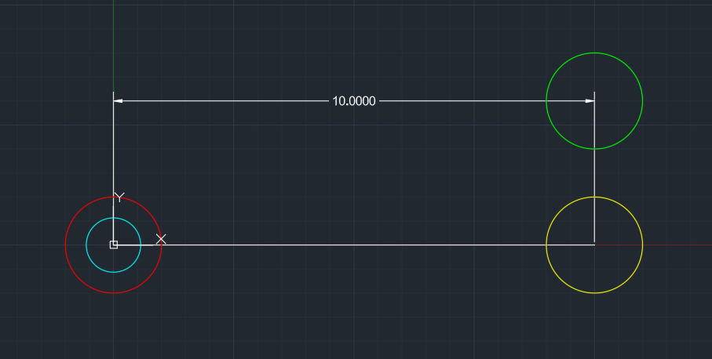
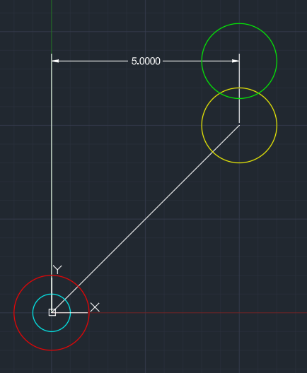
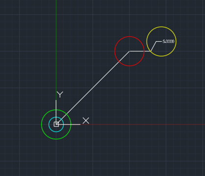
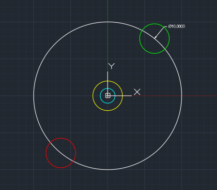
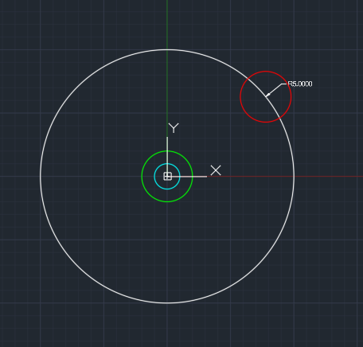
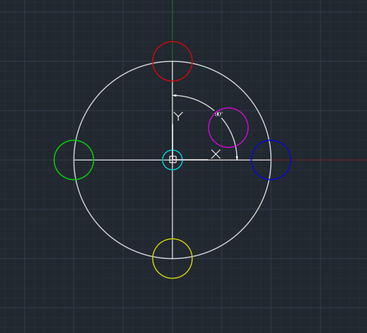
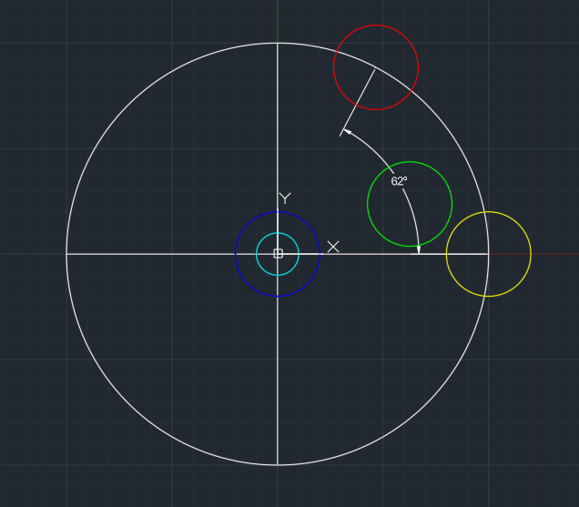

# Dimensions

Dimension entities annotate distances, angles, and coordinates in a drawing. All dimension types share common properties from the `Dimension` base class and have specific points that control their geometry.

## Common dimension properties

| Property | Type | Description |
|---|---|---|
| `definitionPoint` | `XYZ` | Definition point (green in diagrams) |
| `insertionPoint` | `XYZ` | Text insertion point (cyan in diagrams) |
| `style` | `DimensionStyle` | Dimension style controlling appearance |
| `text` | `string` | Override text (empty = automatic measurement) |
| `rotation` | `number` | Text rotation angle |

## Aligned

| Color | Property |
|---|---|
| RED | `firstPoint` |
| YELLOW | `secondPoint` |
| GREEN | `definitionPoint` |
| CYAN | `insertionPoint` |

## Linear

| Color | Property |
|---|---|
| RED | `firstPoint` |
| YELLOW | `secondPoint` |
| GREEN | `definitionPoint` |
| CYAN | `insertionPoint` |

## Ordinate

| Color | Property |
|---|---|
| RED | `featureLocation` |
| YELLOW | `leaderEndpoint` |
| GREEN | `definitionPoint` |
| CYAN | `insertionPoint` |

## Diameter

| Color | Property |
|---|---|
| RED | `angleVertex` |
| YELLOW | `center` |
| GREEN | `definitionPoint` |
| CYAN | `insertionPoint` |

## Radius

| Color | Property |
|---|---|
| RED | `angleVertex` |
| GREEN | `definitionPoint` |
| CYAN | `insertionPoint` |

## Angular2Line

| Color | Property |
|---|---|
| RED | `firstPoint` |
| YELLOW | `secondPoint` |
| BLUE | `angleVertex` |
| MAGENTA | `dimensionArc` |
| GREEN | `definitionPoint` |
| CYAN | `insertionPoint` |

## Angular3Pt

| Color | Property |
|---|---|
| RED | `firstPoint` |
| YELLOW | `secondPoint` |
| BLUE | `angleVertex` |
| GREEN | `definitionPoint` |
| CYAN | `insertionPoint` |
